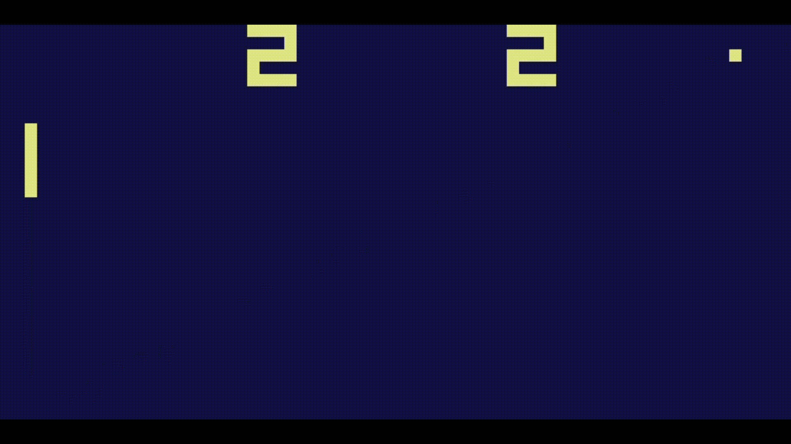

## Chip8 emulator
An exploration of how classic chip8 machines execute and perform to run games like pong and tetris.

## Learning Objectives
- Understanding the principles chip8 machines CPU.
- Learning how chip8 games were made and perform on chip8 machines through operation codes and special quirks.

## Here are some demonstrations

Pong  
  
 
Tetris  

